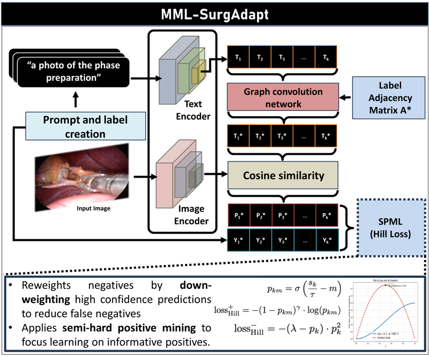

<div align="center">
<a href="http://camma.u-strasbg.fr/">

</a>
</div>

# **[MICCAI 2025] Procedure-Aware Surgical Video-language Pretraining with Hierarchical Knowledge Augmentation**
_Soham Walimbe, _Britty Baby_ [Vinkle Srivastav](https://vinkle.github.io/), Nicolas Padoy_,  **MICCAI 2025** 

[](https://arxiv.org/abs/2507.05020)
### MML-SurgAdapt framework


# MML - SurgAdapt

This repository contains the codebase for **MML - SurgAdapt**, an adaptation of the CLIP for surgery. The project is designed for multi-task surgical computer vision and supports easy setup, training, and inference.

---

## Table of Contents
1. [Environment Setup](#environment-setup)
2. [Data Setup](#data-setup)
3. [Running Training](#running-training)
4. [Running Inference](#running-inference)
5. [Pretrained Weights](#pretrained-weights)
6. [Run Baselines](#run-baselines)

---

## Environment Setup

Follow these steps to set up the environment:

1. **Clone the Repository**  
   ```bash
   git clone https://github.com/CAMMA-public/MMA-SurgAdapt.git
   cd MMA-SurgAdapt

2. **Create a Python Virtual Environment**
   ```bash
   conda create -n env python=3.12
   conda activate env

3. **Install Dependencies**
   ```bash
   conda install pytorch==2.2.2 torchvision==0.17.2 torchaudio==2.2.2 pytorch-cuda=12.1 -c pytorch -c nvidia
   pip install -r requirements.txt

## Data Setup

Set up your data in the cholec directory as follows:
```
cholec/
├── data/
│   ├── cholec80/ # Phase recognition
│   ├── endoscapes/ # CVS assessment
│   ├── cholect50/ # Triplet recognition
│   ├── triplet_data/ # Optional: For model initialization with LatentGraph pseudolabels
│   └── triplet_val_data/ # Optional: For model initialization with LatentGraph pseudolabels
├── cholec_labels_index.npy
├── cholec_labels.txt
├── cholec_super_labels.txt
└── word2vec_similarity_matrix.npy
```

Set up the configs for training and testing in the `configs/surgadapt+cholec.yaml`:  
Batch size, lr, epochs, dir, loss, backbone, seed, flags for SP validation, Pseudolabel initialization, Label file, init/getitem, partial positive setup.  
For evaluation, specify checkpoint, dir, and loss.

## Running Training

For training the model, use the config file given for each experiment to set the configuration for training and run, for example:
```bash
python train.py -c configs/surgadapt+cholec_pp_hill.yaml
```

## Running Inference

For testing the model, use the config file given for each experiment to set the configuration (change the directory for saving results) for testing and run, for example:
```bash
python test.py -c configs/surgadapt+cholec_pp_hill.yaml
```

## Pretrained Weights

Model weights have been saved as follows:
```
MMLSurgAdapt_checkpoints/
├── Baselines/ # One ckpt file each
│   ├── R50/
│   ├── CLIP-VitL/
│   ├── DualCoop/
│   ├── VLPL/
│   ├── HSPNet/
│   ├── Multi-task/
│   └── Task-specific/
│       ├── R50/ # 1 ckpt per dataset
│       └── CLIP/ # 1 ckpt per dataset
├── Loss_experiments/ # All loss functions here, one ckpt each
├── SP Hill/ # Single positive, 5 ckpts
├── SP WAN/ # 5 ckpts
├── SP SPLC/ # 5 ckpts
├── PP Hill/ # Partial positive, 5 ckpts
├── PP WAN/ # 5 ckpts
└── PP SPLC/ # 5 ckpts
```

## Run Baselines

For DualCoOp, use the README file to set up the environment, set the data folder as given above (not in `cholec/`).  
```bash
cd baselines/Dualcoop/
python train.py
```

For Task-specific baselines, use config files for the experiments after setting up the data, as above (in `cholec/`).
```bash
cd baselines/TS+multitask/
python train.py -c configs/r50+endo.yaml
```
For multi-task baseline:
```bash
cd baselines/TS+multitask/
python train_multitask.py
```

## Citation
If you use our code or models in your research, please cite with:
```bibtex
@article{walimbe2025adaptation,
  title={Adaptation of Multi-modal Representation Models for Multi-task Surgical Computer Vision},
  author={Walimbe, Soham and Baby, Britty and Srivastav, Vinkle and Padoy, Nicolas},
  booktitle={International Conference on Medical Image Computing and Computer-Assisted Intervention},
  year={2025},
  organization={Springer}
}
```

## License
This code and models are available for non-commercial scientific research purposes as defined in the [CC BY-NC-SA 4.0](https://creativecommons.org/licenses/by-nc-sa/4.0/). By downloading and using this code you agree to the terms in the [LICENSE](LICENSE). Third-party codes are subject to their respective licenses.
